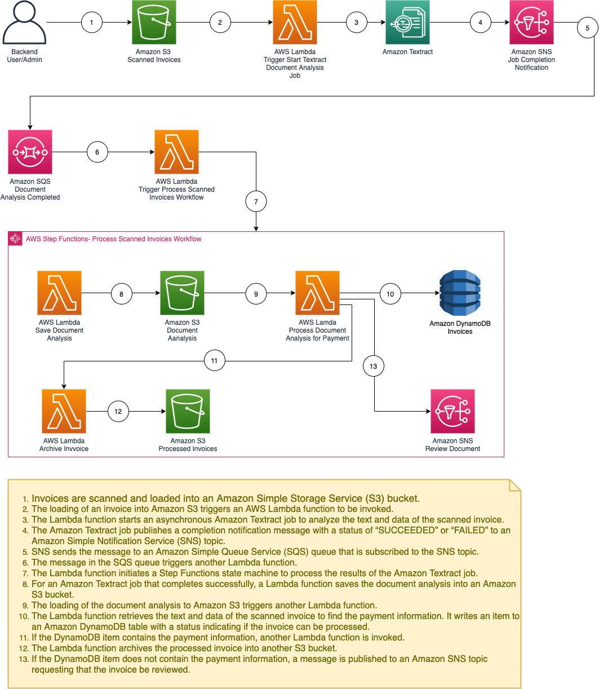

## Getting started with RPA using AWS Step Functions and Amazon Textract

[AWS Step
Functions](https://aws.amazon.com/step-functions/) is a serverless function
orchestrator and workflow automation tool. [Amazon Textract](https://aws.amazon.com/textract/)
is a fully managed machine learning service that automatically extracts text
and data from scanned documents. Combining these services, you can create an RPA bot
to automate the processing of documents.

## System Architect

## Deploying the solution

1.  Download code from GitHub repo
    (<https://github.com/buithaibinh/aws-step-functions-rpa>).

2.  Run the following command to build the artifacts locally on your
    workstation:

        yarn install

3.  Run the following command to deploy solution

        cdk deploy

## Testing the solution

To test the solution, upload the .PDF test invoices from the design/invoices
folder of the downloaded solution to the S3 scanned-invoices.

Confirm result on DynamoDB

## Cleanup

Run the following command to cleanup solution

    cdk destroy